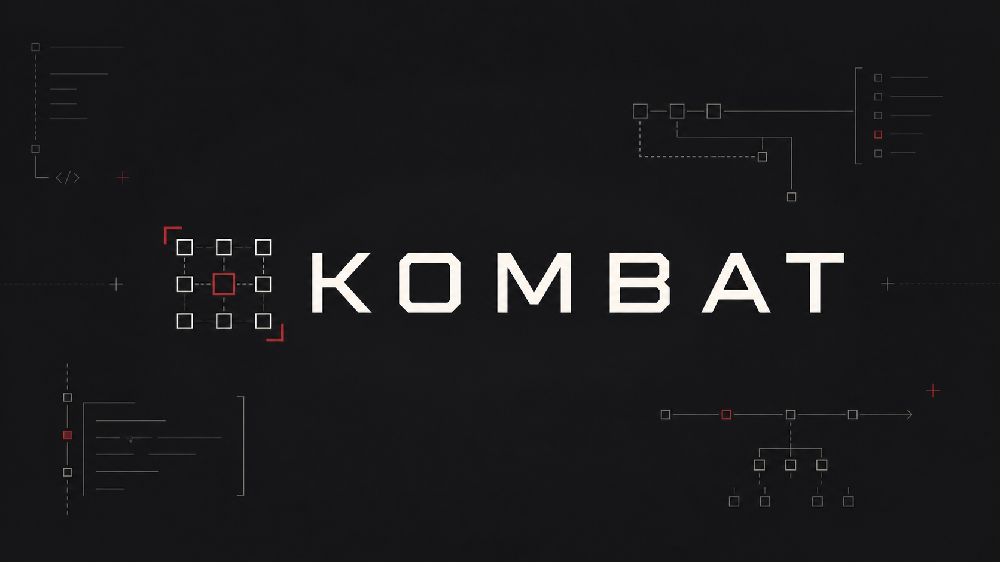

<p align="center">
  
</p>

<p align="center">
  A clean, modular combat engine for modern Minecraft servers.
</p>

<p align="center">
  <a href="https://github.com/Mides-Studio/Kombat/actions/workflows/build.yml"></a>
  
  
  
</p>

Kombat brings responsive classic combat to Bukkit-compatible, Paper, Folia, and
Minestom servers without coupling the combat rules to a single runtime. Its public
API, combat engine, and platform adapters are separate modules so integrations stay
small and predictable.

## Highlights

- Configurable attack speed, hit delay, damage, critical hits, and sweep attacks
- Named knockback profiles with per-player assignment and a live default
- Combos, kills, deaths, streaks, hits, and damage statistics
- Persistent player preferences and statistics on every supported platform
- Cancellable and mutable combat events through a typed, owner-aware event bus
- Safe configuration reloads and thread-safe runtime state
- Dedicated shaded distributions for Bukkit/Paper, Folia, and Minestom
- Region-owned entity scheduling in the Folia distribution

## Platforms

| Runtime | Distribution | Java | Integration |
| --- | --- | ---: | --- |
| Bukkit-compatible / Paper 1.21.10 | `Kombat-Bukkit-<version>.jar` | 21+ | Drop-in plugin |
| Folia 1.21.10 | `Kombat-Folia-<version>.jar` | 21+ | Drop-in, region-safe plugin |
| Minestom 1.21.10 | `Kombat-Minestom-<version>.jar` | 25+ | Embeddable library |

Use exactly one distribution for the server runtime. The Minestom artifact does
not bundle Minestom itself.

## Installation

### Bukkit-compatible, Paper, and Folia

1. Download the matching JAR from
   [GitHub Releases](https://github.com/Mides-Studio/Kombat/releases).
2. Place it in the server's `plugins` directory.
3. Start the server once to generate the configuration.
4. Edit `plugins/Kombat/config.yml`, then run `/kombat reload`.

Player data is stored in `plugins/Kombat/players.yml`.

### Minestom

Add both Minestom and the Kombat Minestom JAR to the host classpath. Install
Kombat after `MinecraftServer.init()` and close it during shutdown:

```java
import git.immutabled.kombat.minestorm.StormKombatPlugin;
import net.minestom.server.MinecraftServer;

import java.nio.file.Path;

MinecraftServer server = MinecraftServer.init();
StormKombatPlugin kombat = new StormKombatPlugin(
        Path.of("plugins", "Kombat"),
        sender -> /* your permission check */ true
).install();

// During host shutdown:
kombat.close();
```

Minestom generates `kombat.properties` and `players.properties` in the supplied
data directory. If no permission hook is supplied, administrative commands are
restricted to non-player senders.

## Commands

| Command | Purpose |
| --- | --- |
| `/kombat help` | Show available commands |
| `/kombat status` | Show runtime state and loaded data |
| `/kombat toggle` | Toggle classic mechanics for yourself |
| `/kombat stats [player]` | Show combat statistics |
| `/kombat reload` | Reload the configuration |
| `/kombat enable\|disable` | Change the global runtime state |
| `/knockback list` | List available profiles |
| `/knockback info <profile>` | Inspect a profile |
| `/knockback set <profile> [player]` | Assign a profile |
| `/knockback reset [player]` | Return to the default profile |
| `/knockback default <profile>` | Change the global default |

The Bukkit/Folia distributions expose these permissions:

| Permission | Default |
| --- | --- |
| `kombat.command` | Everyone |
| `kombat.toggle` | Everyone |
| `kombat.stats` | Everyone |
| `kombat.stats.others` | Operators |
| `kombat.knockback` | Everyone |
| `kombat.knockback.assign` | Operators |
| `kombat.admin` | Operators |

## Configuration

The generated configuration contains two ready-to-use profiles: `classic` and
`boxing`.

```yaml
combat:
  attack-speed: 24.0
  enable-sweep: false
  hit-delay-ms: 450
  base-damage-multiplier: 1.0
  critical-damage-multiplier: 1.5
  first-hit-damage-boost: 1.0
  critical-enabled: true

knockback:
  default-profile: classic
  profiles:
    classic:
      horizontal: 0.40
      vertical: 0.36
      friction: 0.60
      sprint-multiplier: 1.35
      max-distance: 1.20
      air-movement: true
      sprint-knockback: true

features:
  knockback: true
  statistics: true
  combos: true
```

See the complete defaults in
[`config.yml`](platform/paper-common/src/main/resources/config.yml).

## API

Other plugins can access the active runtime through `KombatProvider`. Listener
registrations are removable individually or by owner:

```java
import git.immutabled.kombat.api.KombatAPI;
import git.immutabled.kombat.api.KombatProvider;
import git.immutabled.kombat.api.events.defaults.PlayerDamageEvent;
import git.immutabled.kombat.api.events.priority.EventPriority;

KombatAPI api = KombatProvider.get();

api.getEventBus().register(
        this,
        PlayerDamageEvent.class,
        EventPriority.NORMAL,
        event -> {
            if (event.isCritical()) {
                event.setDamage(event.getDamage() * 1.10);
            }
        }
);

// On disable:
api.getEventBus().unregisterAll(this);
```

The API and core modules target Java 21. Minestom hosts require Java 25 because
the current Minestom dependency does.

## Architecture

```text
api                   Public contracts, events, profiles, and player model
└── core              Platform-neutral engine and thread-safe runtime state

platform
├── paper-common      Shared Bukkit/Paper/Folia lifecycle and listeners
│   ├── bukkit        Standard scheduler distribution
│   └── folia         Region scheduler distribution
└── minestorm         Embeddable Minestom adapter
```

## Building

The complete build requires JDK 25. Gradle still compiles the API, core, Bukkit,
and Folia bytecode for Java 21.

```bash
./gradlew clean build
```

Release-ready JARs are written to:

```text
platform/bukkit/build/libs/Kombat-Bukkit-<version>.jar
platform/folia/build/libs/Kombat-Folia-<version>.jar
platform/minestorm/build/libs/Kombat-Minestom-<version>.jar
```

Tags matching `v*` trigger the release workflow and publish all three JARs with
SHA-256 checksums.

## Contributing

Read [`CONTRIBUTING.md`](CONTRIBUTING.md) before opening a pull request. Security
issues should follow [`SECURITY.md`](SECURITY.md).

## License

Kombat is source-available proprietary software. See [`LICENSE`](LICENSE).
